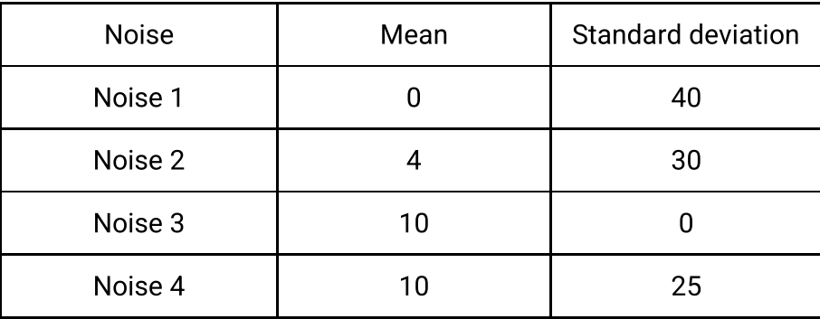

---
runme:
  id: 01HJATV370592R8PATG8HYV8AE
  version: v2.0
---

# adding noise

we want to add below noises with below densities : 

- Gaussian noise ( densities : 0.05, 0.1, 0.2, 0.4 )
- speckle noise ( densities : 0.0001, 0.0005, 0.001, 0.002 )
- Poisson noise ( densities : 0.1, 0.5, 1.0, 2.0 )
- Gaussian noise
 
 densities : 

  